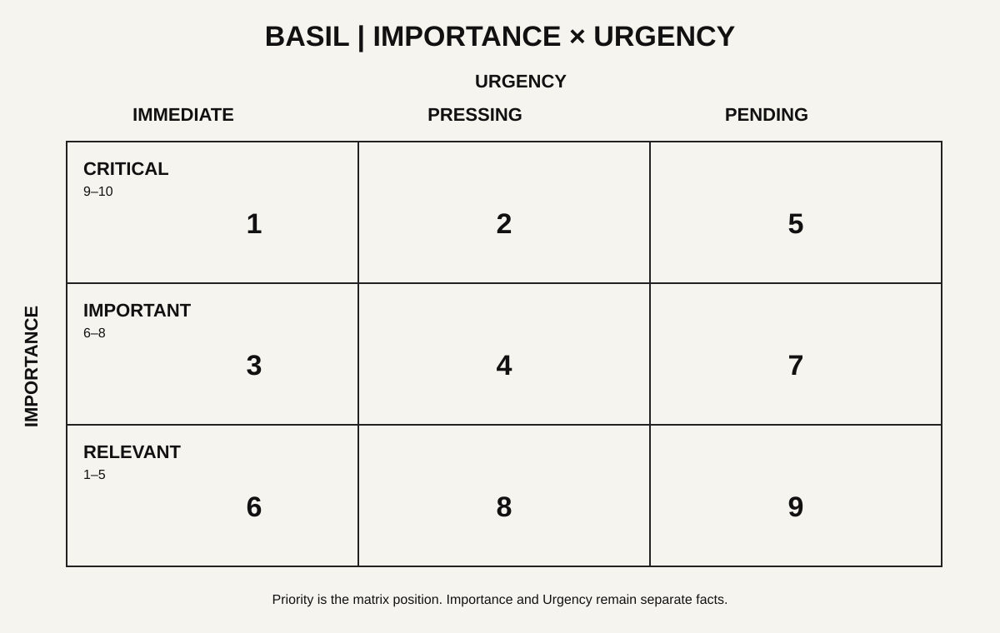

# Visual Execution Layer

**Source lineage:** BASIL Visual Execution Layer Concept & Solution Brief v1.0 and Operating Protocol v1.2, 18 August 2026, subject to later reconciliation decisions.

The Visual Execution Layer is the human-facing behavioural interface for BASIL. It represents canonical state; it does not replace it.

## Governing values

- reality over neatness
- execution over organisation
- progressive disclosure
- professional reinforcement rather than cheap gamification
- behavioural and decision value over abstract implementation purity

## Strategic Pressure Map

The current 3×3 Critical/Important/Relevant × Immediate/Pressing/Pending matrix is rendered as a crowded strategic map.

- every active task remains visible as a dot/circle
- dots compete for finite territory inside their correct cell
- congestion is information, not a layout defect
- position = Importance × Urgency classification
- size may represent restrained reward/point value
- colour/symbol may represent AXIS4+1 mode

## AXIS4+1

Execution framing modes:

- Strategist — direction, framing, synthesis, prioritisation and choice
- Analyst — evidence, investigation, modelling, evaluation and interpretation
- Investor — value, allocation, leverage, opportunity and return
- Engineer — building, implementation, systems and process
- Admin — processing, filing, routine correspondence and necessary drudgery

Admin is a practical execution mode rather than a change to AXIS4 itself.

## Gravity Channel

The execution view represents active tasks as geometric blocks in slow free-fall towards their real deadlines.

- width = Importance
- height = estimated execution duration
- vertical position = time remaining to actual deadline
- colour/symbol = AXIS4+1 mode
- initial X position contains deliberate randomness
- movement remains slow, restrained and professional
- a completion buffer appears above zero-time
- a task joins the overdue stack only after its actual deadline is reached
- overdue geometry remains irregular rather than auto-packed

Forecast controls such as 6h/12h/24h/48h simulate the future workload if nothing is completed. They are simulations, not filters.

## Commitment protocol

The Strategic Pressure Map is primarily for interrogation. The Gravity Channel is for commitment.

First selection: `Start` or `Skip`. One skip only. After the skip has been used: `Start` or `Delete`. Delete removes the task from active execution but preserves source/history.

## Visual style

Use the established BASIL mark and a mature, precise visual language. Avoid confetti, arcade physics, treasure imagery, cartoonish badges and over-saturated interfaces. Dense information is acceptable when it communicates real operational pressure.
